**使用手册**

# 目录 

- <a href="#1">注册与登录</a>
- <a href="#2">上传对账单</a>
- <a href="#3">查看流水</a>
  - <a href="#3.1">已上传数据</a>
  - <a href="#3.2">对账单查询</a>
- <a href="#4">企业的管理与授权</a>
  - <a href="#4.1">企业维护</a>
  - <a href="#4.2">授权管理</a>

# 一 注册与登录 

- 登陆方式可以使用微信扫描二维码直接登录，也可以免费注册使用邮箱以及密码登录。如果您是新用户，系统将询问您的公司名称，**请输入中文名称**，否则将无法进入系统。

  <pre>
    
</pre>

- 登录账号后，可在账号下“账号与安全”中的“个人信息”修改姓名，联系电话，职位。如果需要修改密码，您可以在“账号密码”下修改密码，如果您需要接触微信绑定，也可在这里解除。

  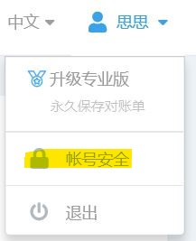

### <a href="#0">back</a>

# 二 上传对账单 

1. 点击页面右上角的上传对账单就会跳转到您的本地文件管理中，只要找到您的流水文件选中打开即可上传。

> 如果您的对账单显示解析错误，那么很有可能是您上传的文件格式错误，建议您点击弹窗右上角的”下载标准现金模板“重新填写上传。
>
> 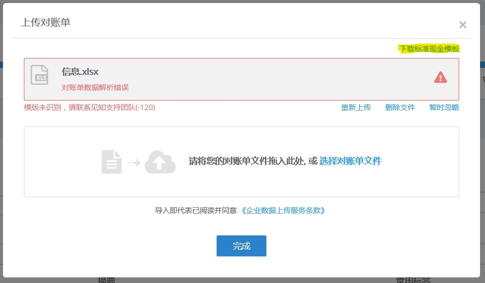

2. 对账单显示解析成功后，如果您还有多个对账单文件，可以继续上传；如果没有，请点击完成。

   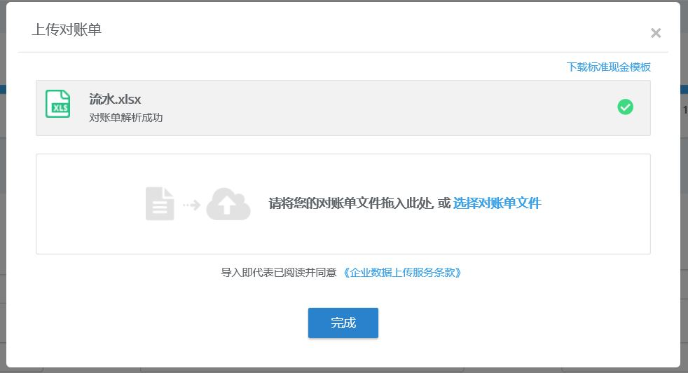

3. 如果系统未能自动为您的企业自动认领对账单里的银行账户，请遵照指示自行拖拽账户至目标企业下。一个企业可以拥有**多个银行账户**。

### <a href="#0">back</a>

# 三 查看流水 

### 为您整合多个银行账户下的流水数据

## 3.1 已上传数据 

- 流水文件上传完毕后，您可以查看流水数据的覆盖情况。如果横条为蓝色，代表流水数据覆盖；如果为灰色，代表流水数据缺失。您可以点击方框上方数字左右的箭头调整查看的年份。

  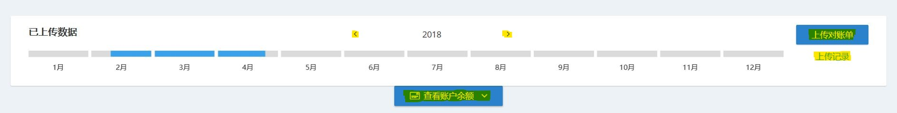

- 如果您想要更加确切地直到您所上传的流水文件所覆盖的日期，您可以点击横条，在弹窗右侧选择您想要查看的银行账户，即可在弹窗左侧的日历了解流水覆盖的详细情况：黑色的日期为已覆盖，灰色的日期为流水缺失。

  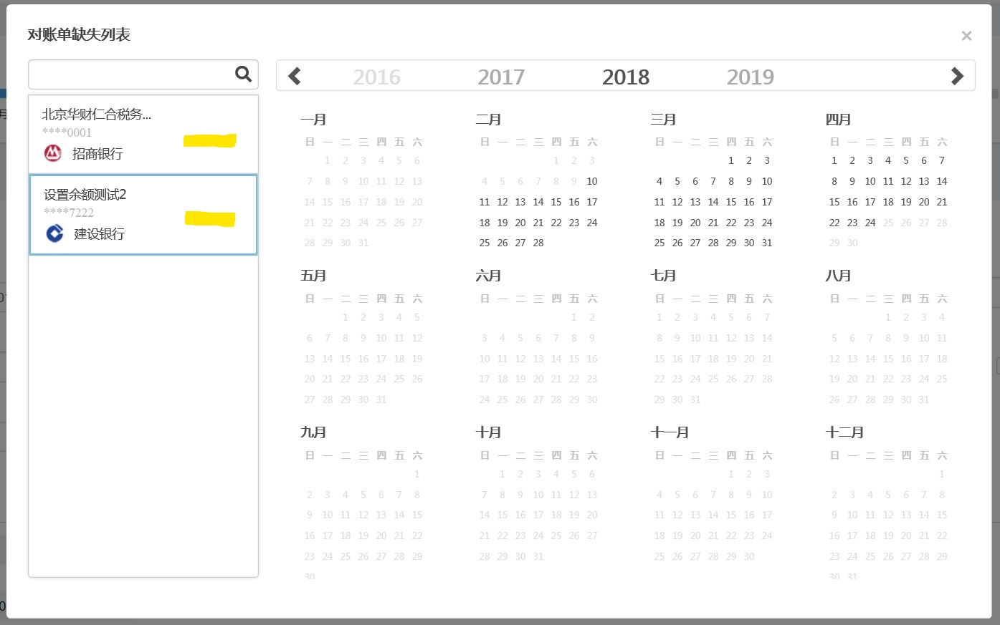

- 如果您想要一览您账户内的余额，可以点击方框下方的”查看账户余额“。

- 如果您想要查看对账单上传记录或者删除对账单，请点击方框右侧的”上传记录“。

  - 您在这个页面下也可以看到流水文件的覆盖状况，以及每次文件上传的情况。
  - 您可以通过上传时间，文件名，数据时间段，以及上传者（点击高级筛选后）来查询您上传的文件。
  - 在文件条目的状态栏下，您可以清楚的看到文件上传的具体过程及失败的原因；在操作栏下，您可以预览你所上传的对账单文件、下载该文件、或删除该文件。注意删除对账单文件后，系统内根据该文件生成的相关数据会被清除。该操作无法撤销，**慎点**。

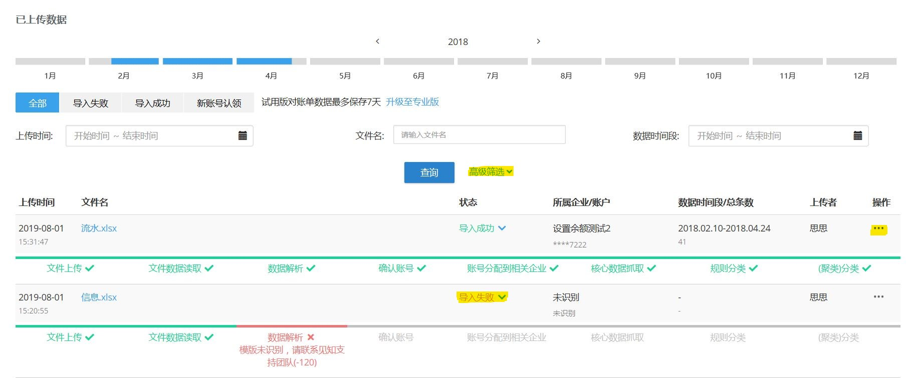

## 3.2 对账单查询 

页面最上方的搜索栏可以输入关键字查询对账单、供应商、客户、或银行账户。

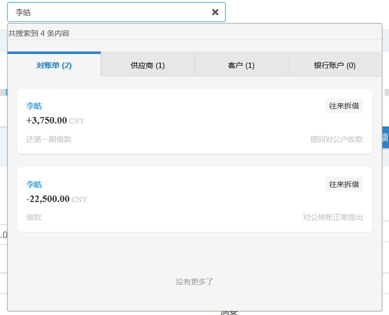

您还可以在页面内的对账单查询下，通过编辑起止日期，出入金额的范围，流水分类等交易信息来形成查询标签锁定目标流水。系统的默认查询标签为过去三个月的流水，如果您需要删除查询标签，点击该标签卡片右侧的标识即可。

- 全部、支出、收入：可以切换被查询的流水范围。

- 导出：可以以Excel文档的形式导出该查询窗口下的所有流水。
- 统计金额：可以计算该查询窗口下所有流水的总收入与总支出金额。

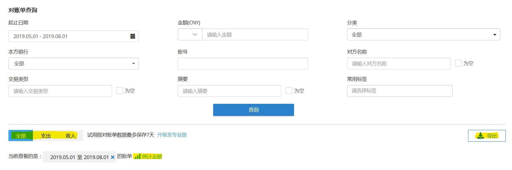

对账单查询结果:

- 排序：您可以点击表头”交易时间“、”本方账号“等明细左侧或右侧的箭头来进行针对该特征升序或降序的排列。如果某列表头左侧或右侧出现了箭头，那么就表示查询结果当前以该特征进行排序（箭头向上即为升序，向下即为降序）

  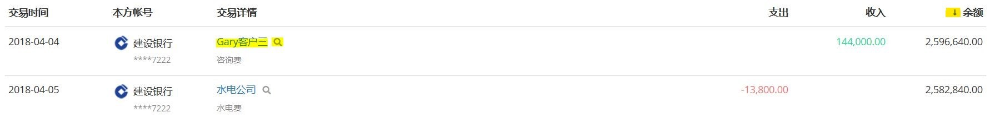

- 对手方详情：点击流水条目中的对手方名称就会弹出对手方详情。再弹窗内，您可以查看该对手方收支趋势的柱状图与付款周期的散点图。在弹窗右侧，您可以设定年份与月份查看特定时间内该对手方的流水。您还可以在标签下为该对手方添加标签。

  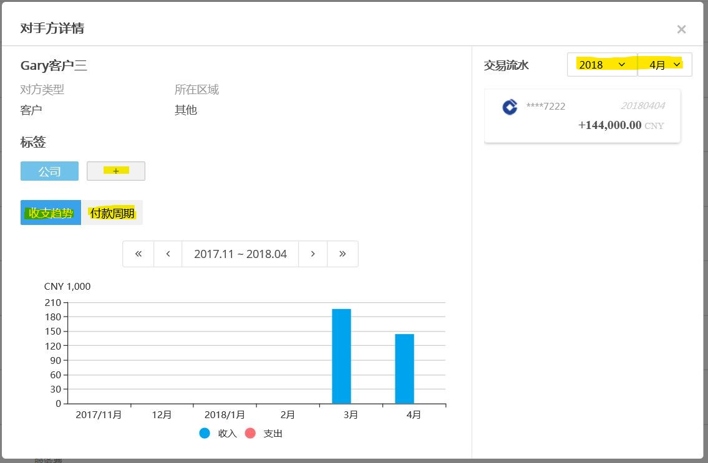

- 对账单详情：点击流水条目任意处即可查看对账单详情。您可以在此修改为该流水的摘要，或为该流水添加标签。如果您需要给您的流水添加一些文件备注可以点击弹窗下方的”添加附件“进行备注。点击下载还可以下载包含该流水的流水文件。

- 对手方名称右侧的标识：点击此表示即可查看包含该对手方的所有流水条目。

### <a href="#0">back</a>

# 四 企业的管理与授权 

如果您的企业下包含多层结构的子公司，可以到屏幕右上角的公司名称下拉菜单的“企业维护”进行编辑。在这个界面中公司被划分为三层结构，分别是集团，组织，与企业。编辑后，您的企业结构将在下拉菜单中有所体现，您可以点击各个层级的表示进行视角切换。

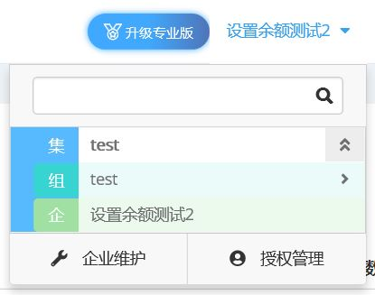

## 4.1 企业维护  

基本操作：点击词条右侧的操作栏

- 切换：可以切换到该层级视角下查看集团帐下所有企业所上传的所有流水数据。

- 授权：可以授权在系统中注册过的其它用户对该层级进行不同权限的操作。

  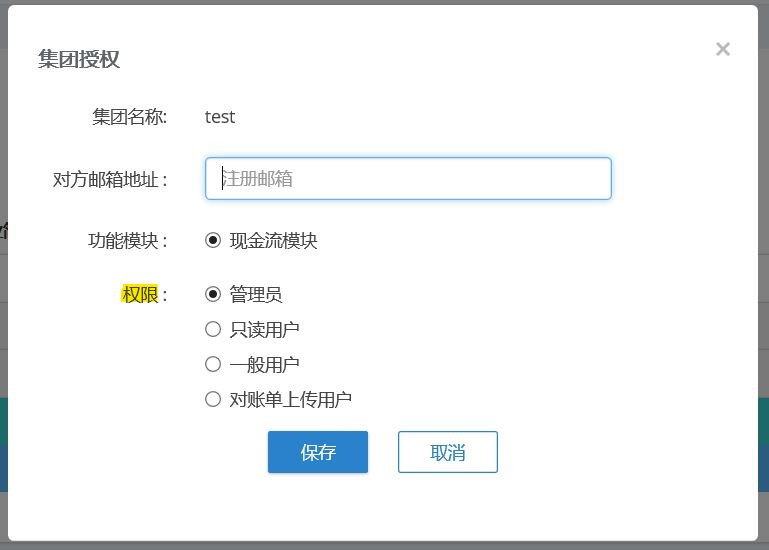

- 修改内容：可以修改名称以及备注，如果您的企业名称为英文，您可以在此修改为英文。

  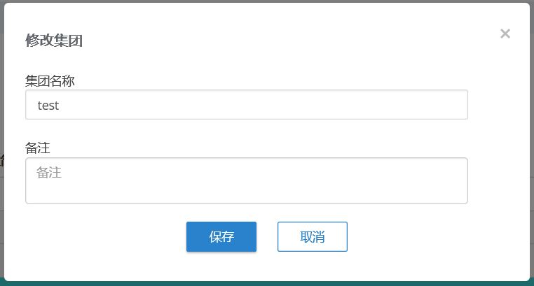

- 删除：删除该层级及其名下的所有数据，**慎点**。

针对组的特殊操作：

- 修改内容：可以修改分组所属的企业、分组名称、以及组备注。

  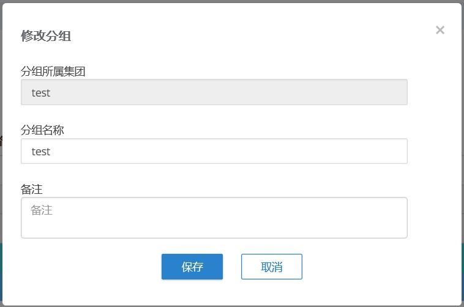

- 添加已存在的公司：可以把账号下的企业移至此分组内。

  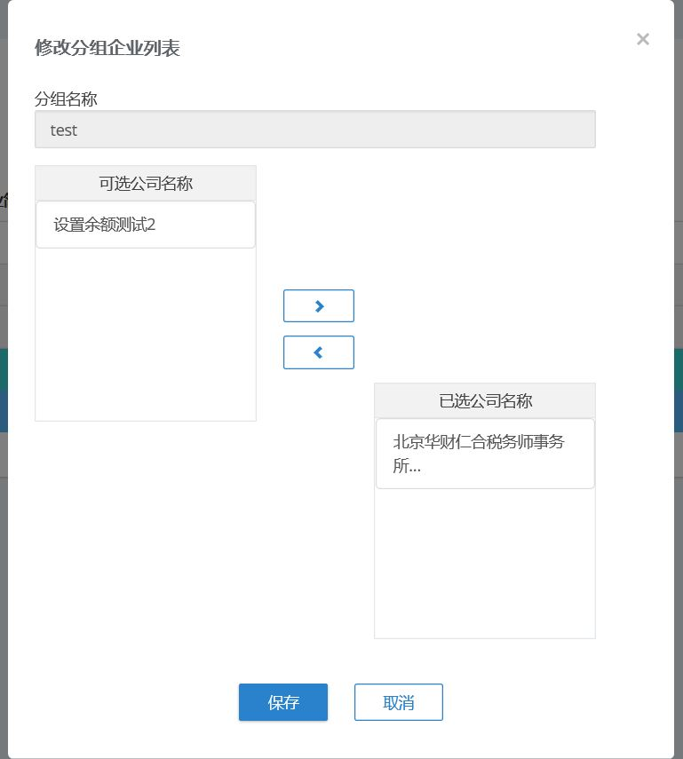

针对企业的特殊操作：

- 修改内容：可以修改企业名称，注册资本，所在地区等企业信息。

  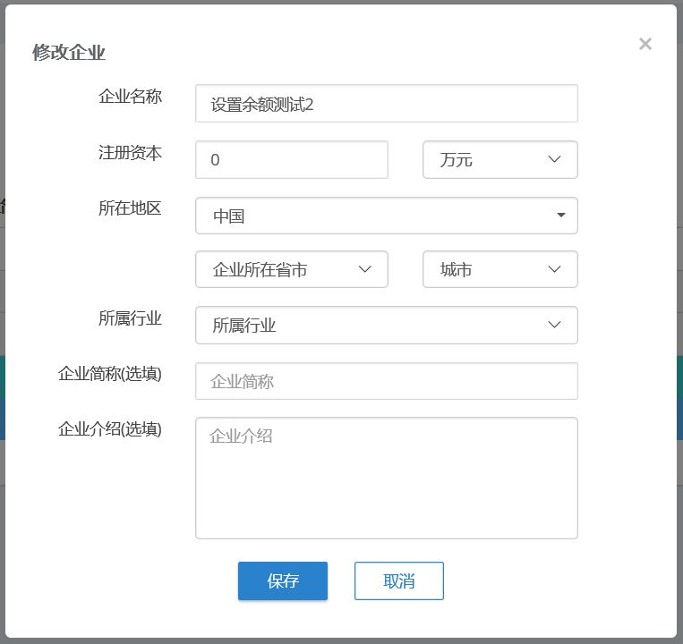

- 关闭：可以关闭该企业，使其不再出现在企业列表中。历史数据会被保留且无法修改，可在已关闭企业中进行查看。此操作无法撤销，**慎点**。

## 4.2 授权管理 

针对集团，分组，企业的授权也可在公司名称下拉菜单的“授权管理“中进行，点击相应词条右侧的”新增“即可。

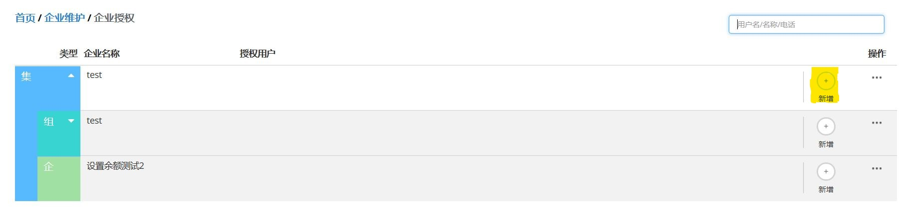

### <a href="#0">back</a>

---

### 其它

语言：目前系统支持中文和英文，如有需要，可以在屏幕右上方进行切换