**QA使用手册**

# 目录 

1. <a href="#1">登陆与账号</a>
    - <a href="#1.1">注册</a>
    - <a href="#1.2">登录</a>
    - <a href="#1.3">账号管理</a>
    - <a href="#1.4">添加尽调机构</a>
2. <a href="#2">创建尽调项目</a>
    - <a href="#2.1">创建项目名称</a>
    - <a href="#2.2">上传项目流水</a>
3. <a href="#3">查看流水分析报告</a>
    - <a href="#3.1">流水数据真伪验证</a>
      - <a href="#3.1.1">对账单完整性</a>
      - <a href="#3.1.2">缺失同名账户</a>
    - <a href="#3.2">企业关联方检查</a>
    - <a href="#3.3">个人挪用提示</a>
    - <a href="#3.4">企业综合还款能力分析</a>
      - <a href="#3.4.1">期间余额</a>
      - <a href="#3.4.2">收支盈亏</a>
      - <a href="#3.4.3">收支构成</a>
      - <a href="#3.4.4">指标性支出</a>
      - <a href="#3.4.5">贷款检查</a>
      - <a href="#3.4.6">核心客户</a>
      - <a href="#3.4.7">核心供应商</a>
4. <a href="#4">完成尽调报告</a>
    - <a href="#4.1">尽调备注添加</a>
    - <a href="#4.2">完成报告</a>
5. <a href="#5">其他信息查询</a>
    - <a href="#5.1">企业信息明细抽查</a>
      - <a href="#5.1.1">排序</a>
      - <a href="#5.1.2">显示总额</a>
      - <a href="#5.1.3">对账单详情</a>
      - <a href="#5.1.4">修改</a>
      - <a href="#5.1.5">对手方详情</a>
      - <a href="#5.1.6">查询</a>
    - <a href="#5.2">其他信息：补上传数据，各种上传状态的说明等</a> 
      - <a href="#5.2.1">补传数据</a>
      - <a href="#5.2.2">修改项目名称</a>
      - <a href="#5.2.3">添加尽调人员</a>

# 1 登录与账号 

## 1.1 注册 

可使用手机号或者邮箱进行注册，然后使用六个字符以上的字符串作为密码。

## 1.2 登录 

登陆方式可以手机号配合验证码登录或者邮箱（手机号）配合密码登录。如果您注册的时候使用的是邮箱，可以在密码登陆后在个人设置下的“账号密码”里绑定手机号，然后就可以使用手机号登录了。

## 1.3 账号管理 

<pre>
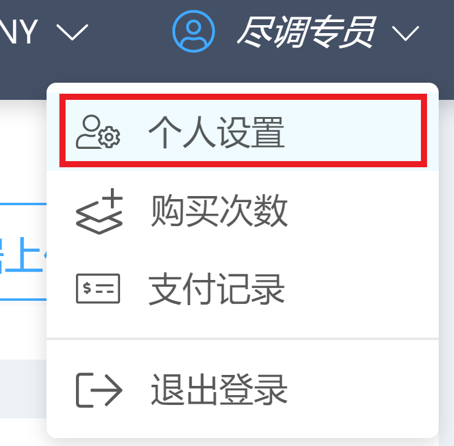   
</pre>
- 可以在个人设置下的“个人信息”里完善姓名，联系电话，所在企业，职位等信息。
- 修改登陆密码可以在“账号密码”下操作。
- 在账号下还可以查看您的购买次数与支付记录。

## 1.4 添加尽调机构 

- 尽调机构选项可以更好地管理团队尽调的项目和授权。在屏幕右上角的账号左边会有一个添加尽调机构的图标。点击该图标创建尽调机构，会有一个弹窗弹出要求输入机构名和组成人员。组成人员分为权限不同的三种角色：尽调员，尽调经理，和管理员。

- 如果需要增加，删除，或修改人员或权限，可以在完成创建后点击尽调机构列表切换到该尽调机构的视角下，然后点击账号下拉列表中的授权管理进行操作。同一账号下个人机构的项目与尽调机构的项目不共享。

<pre>
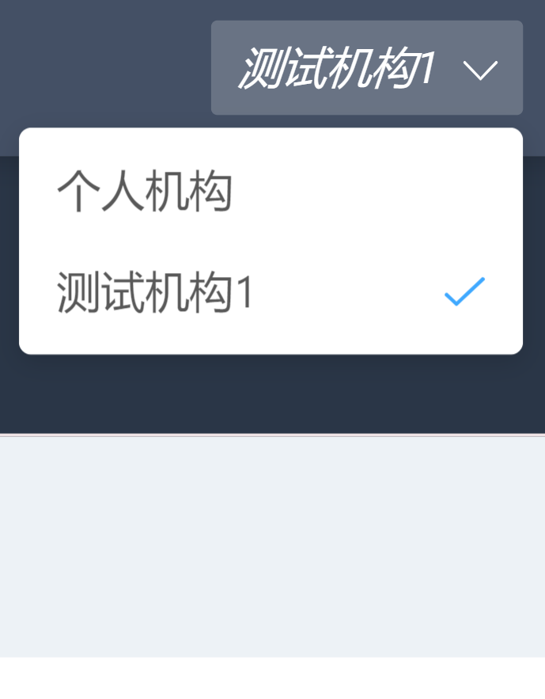    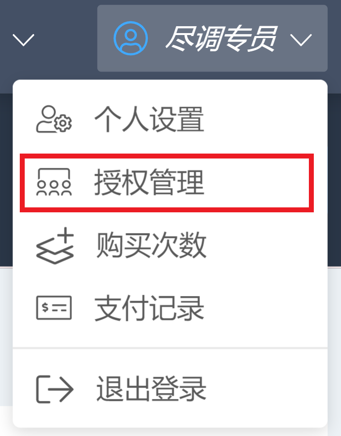
</pre>

#### <a href="#0">back</a>

# 2 创建尽调项目 

## 2.1 创建项目名称 

1. 点击屏幕右上方的“创建项目”后，请依照窗口提示输入项目名称（必填）和项目简介（选填）。

   

## 2.2 上传项目流水 

1. 导入对账单数据，如果您的数据不是从网银下载的官方流水，请点击屏幕中央的“下载标准模板”，然后把数据填入标准模板后再上传。支持成批导入或手动拖拽上传银行对账单。

   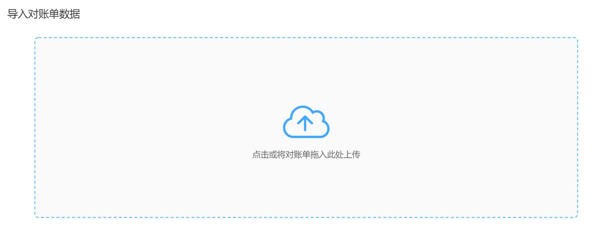

2. 如果您有多个数据文档，可以在文档解析成功后继续上传。数据上传完成后，请点击屏幕下方的“完善对账单信息”。如果您上传的数据里的公司名称、银行账户或币种没有填写或者需要修改，可以点击公司名称处进行修改。

   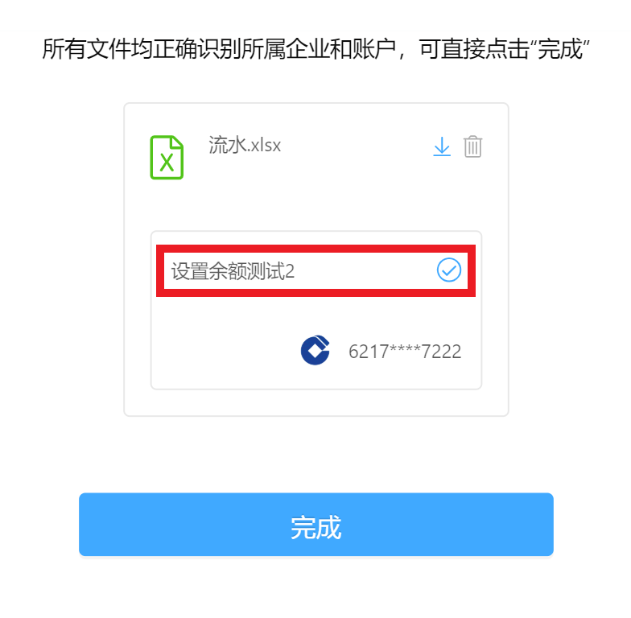

3. 如果您发现您重复上传或者上传了不需要的文档，也可以点击文档右边的标识进行删除。如果文档上传正确，信息识别无误，请点击完成。

   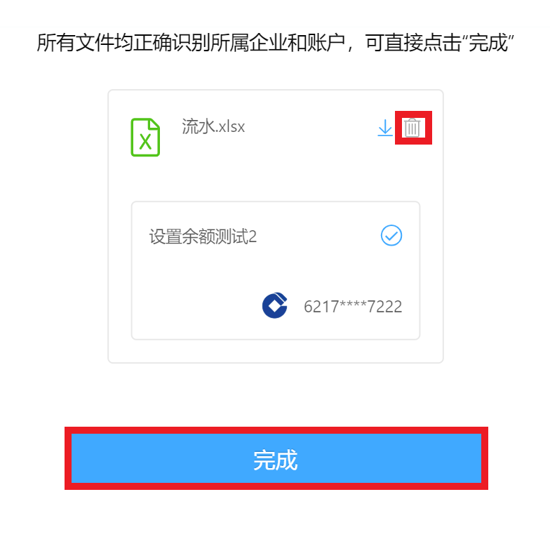

#### <a href="#0">back</a>

# 3 查看尽调结果 

左边显示尽调报告，右边显示报告目录，项目内数据文档的概况，以及尽调企业的公开工商信息。所有报告项目下方都可以点击添加尽调备注。
页面左侧从4个维度显示数据尽调结果。页面右侧是概括性信息， 从尽调结果展示路径、报告的数据信息总览情况和企业的公开工商信息3个方面做了快速展示， 给尽调团队便捷的使用感受。

## 3.1 数据真伪 

### 3.1.1 对账单完整性 
- 系统根据导入对账单数据和资金实际进出情况做校验。如有数据缺失（如人为删减或增加交易数据）的话， 系统会校验监测到余额不匹配，以红色高亮提示数据不匹配的时间段，提示尽调团队。点击覆盖条即可弹出日历具体显示流水覆盖日期。

  

### 3.1.2 缺失同名账户 
- 系统将检查导入的对账单数据中是否存在同名账户。如有缺失，系统将会列出该账户提醒用户上传该同名账户下的对账单使得尽调分析更加全面。

  

## 3.2 企业关联方检查 

- 检查流水中交易频繁、交易额较大的交易对象，并显示尽调对象和它的交易流水。您也可以自定义关联交易的标准，通过点击“关联方检查”右边的设置改变交易频率上限，交易额上限等捕获逻辑，调整关联方检查方案，捕获对更贴合您需求的关联方交易信息。

  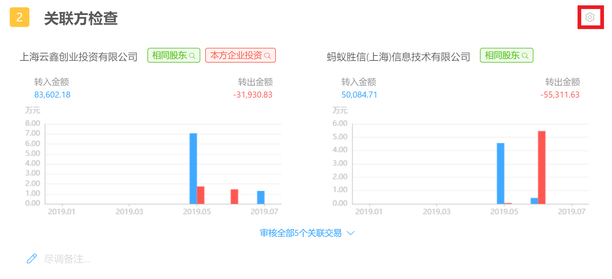

## 3.3个人挪用 

- 系统可将所有个人交易捕捉出来， 并提取疑似挪用公款交易，列出交易详细信息。

  

## 3.4 企业综合还款能力分析 

### 3.4.1 期间余额 

- 根据导入的对账单数据，系统生成账户流水数据期间的余额信息图。虚线标识为被尽调企业的余额平均值，同时系统计算出该企业的资金余额的最大值，最小值，和最新余额的数值。鼠标滑过折线图可以显示该日的资金总额，让尽调这快速了解背调企业的资金水位情况。

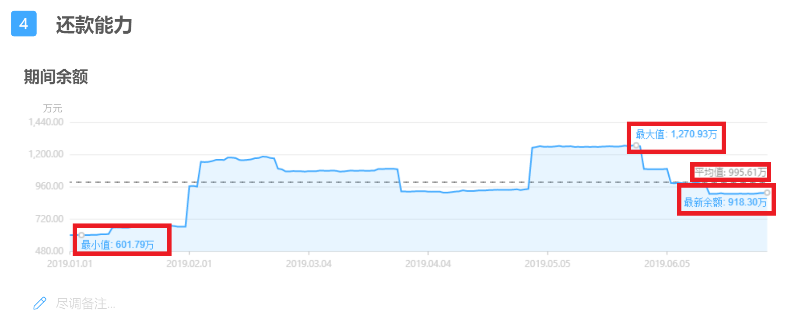

### 3.4.2 收支盈亏 
- 用柱状图显示背调企业的现金流层面的盈亏情况。红色代表支出，蓝色代表收入。通过对账单流水交易信息的自动计算， 呈现出背调企业的月均收入，月均支出等基本数据。（鼠标滑过柱状图可以显示该日的收入支出金额，点击柱状图内立柱即可查看当日流水明细。点击“收支盈亏”右侧的设置可以根据需求修改收入支出内部包含的分类。）

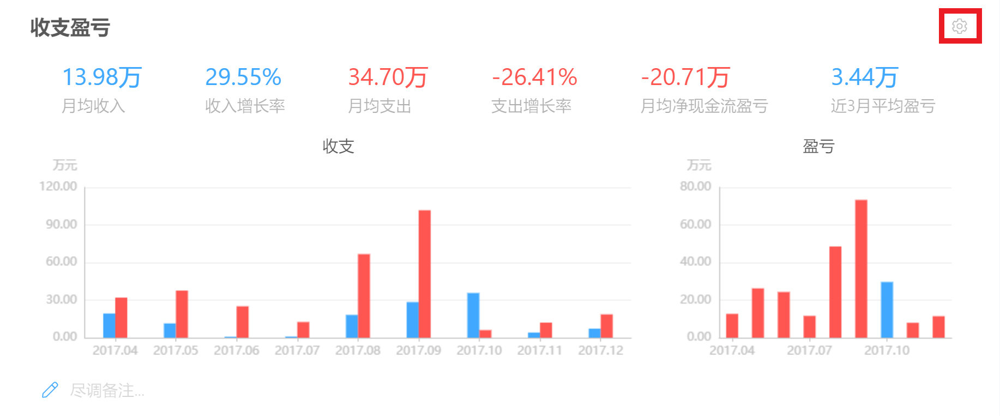

### 3.4.3 收支构成 
- 系统的数据引擎和智能算法会对对账单里的流水进行全自动的类别划分，分析背调企业的收入构成与支出构成。由高到低列出该收入或支出类别在整体收入或支出总额的占比。每个类别在右侧分别用柱状图列出该类别的金额状况（鼠标滑过柱状图可以显示该日的资金总额，点击柱状图内立柱即可查看当日流水明细，点击左侧横柱即可查看全部流水明细。）

### 3.4.4 指标性支出 
- 系统预设了重要的支出类型指标--水电能源及租金、实际纳税、人力成本，直接呈现出这3个指标在背调企业的总支出(或总收入)的占比。（点击“指标性支出”右侧的设置可以根据需求修改支出内部包含的分类。）

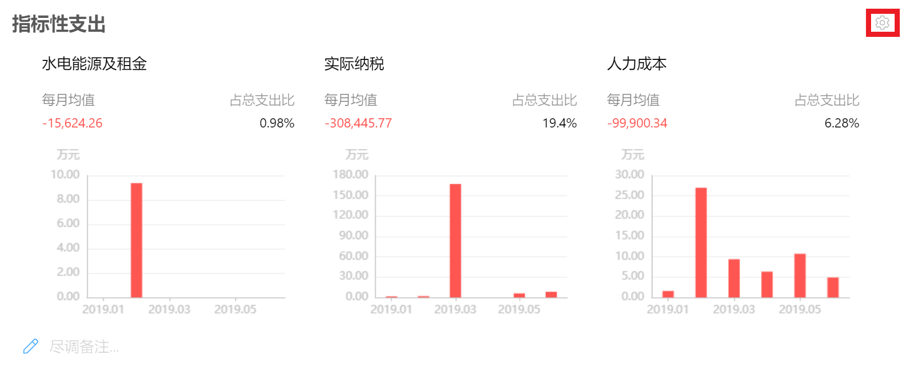

### 3.4.5 贷款检查 
- 通过交易真实数据，捕捉出背调企业的的贷款以及还款情况，细化分类为银行贷款，非银机构借款，和企业拆借。点击条目可以显示对账单详情。

### 3.4.6 核心客户 
- 通过背调企业的收入交易数据，将交易对方按照收入金融和占总比的比例情况自动整理出核心的客户列表。（图标下方可选中一个或多个核心客户查看他们的交易时间及金额，鼠标滑过柱状图可以显示该日的金额，点击柱状图内立柱即可查看流水明细。可以点击“核心客户”右侧的设置根据需求改变客户类型的标签调整核心客户的显示。）

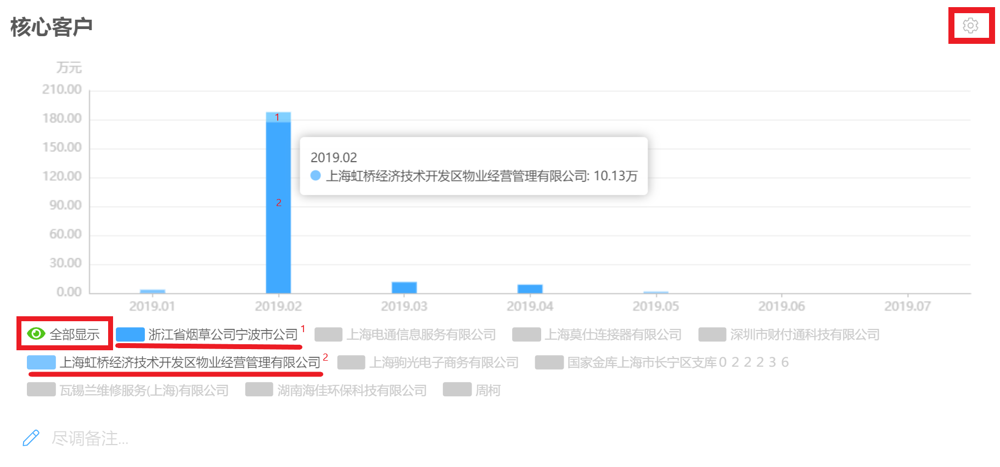

### 3.4.7 核心供应商 
- 通过背调企业的支出交易数据，将交易对方按照支出金额和占总比的比例情况自动整理出核心供应商列表。（图标下方可选中一个或多个核心供应商查看他们的交易时间及金额，鼠标滑过柱状图可以显示该公司该日的金额，点击柱状图内立柱即可查看当日流水明细。可以点击“核心供应商”右侧的设置根据需求改变供应商类型的标签调整核心供应商的显示。）

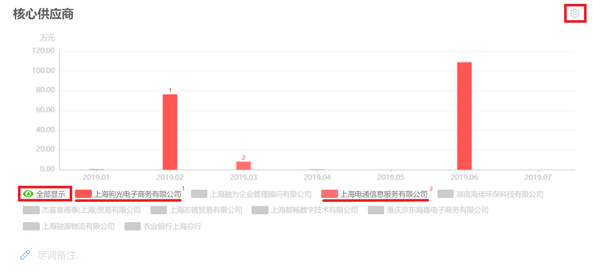

#### <a href="#0">back</a></a>

# 4 完成尽调报告 

## 4.1 尽调备注添加 

当查看完报告中的信息后，可以根据数据的反馈结合业务信息， 在每一个数据分析维度下面添加尽调备注。

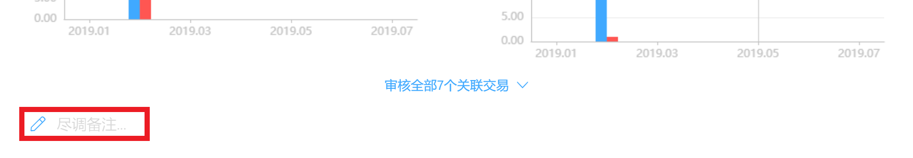

## 4.2 完成报告 

完成所有工作后， 可以在尽调报告下，点击屏幕右上方的“完成尽调”，对被尽调方进行一个项目风险评价（“低”，“中”，或“高”）并保存，表示当前尽调工作已结束。

<pre>
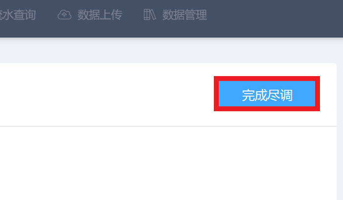    
</pre>

然后您就可以在首页”我的项目“下的”已完成“中找到您刚刚完成的尽调项目。如果没有对项目风险进行评价就返回首页，那么该项目将会被归到”进行中“。如果您需要修改”进行中“或”已完成“的项目，您可以点进条目再次进行操作。

#### <a href="#0">back</a>

# 5 其它信息查询 

## 5.1 企业交易明细抽查 

您可以将背调企业的所有银行交易流水上传到系统中， 对其中的某些交易进行便捷的跨银行各个账号的多维度快速查询。系统可提供以下快速功能：

### 5.1.1 排序 

- 流水条目可以根据交易时间或条目金额进行升序或降序的排序

  
### 5.1.2 显示总额 

- 请点击表格上部的“统计金额”查看统计的收入总额和支出总额

  

### 5.1.3 对账单详情 
- 点击流水条目即可在屏幕右侧显示该条流水的对账单详情，可以对该条流水的备注，分类，和标签进行修改，也可以下载包含这条流水的对账单文件

  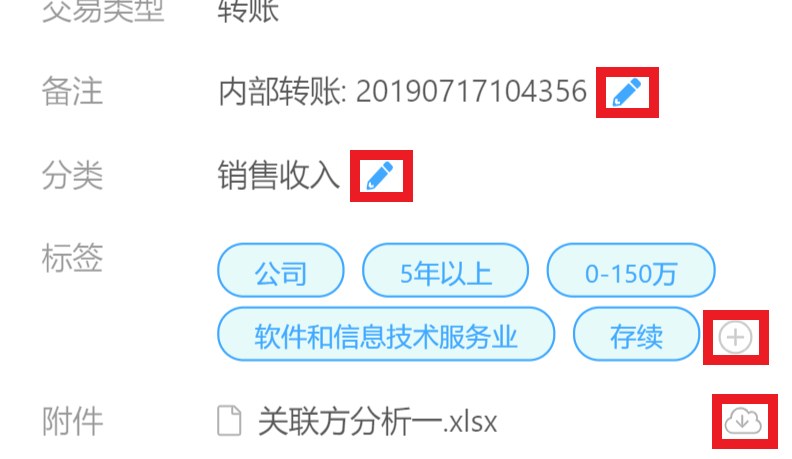

### 5.1.4 修改 

- 修改流水条目摘要：左侧方框选中需要修改的条目，然后在左上“批量操作”下选择“修改摘要”，然后编辑摘要即可。如果点击表头“交易时间”左侧的方框将会选中当前页面加载了的所有条目。

  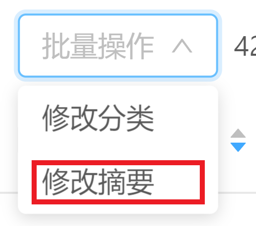

- 修改流水条目分类：可以通过条目左侧的方框选中一条流水然后在左上“批量操作”下选择“修改分类”来进行修改。还可以点击条目“分类”那一栏右侧的铅笔标识，选择“新建规则批量修改”来批量修改流水分类。

  <pre>

<pre>

### 5.1.5 对手方详情 

- 点击对方名称即可查看对手方详情，包括标签（可修改），收支趋势，和付款周期的信息。

<pre>
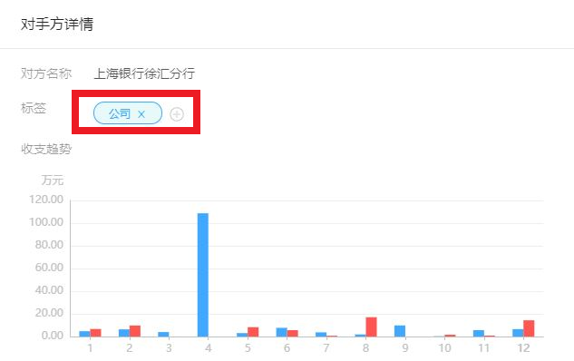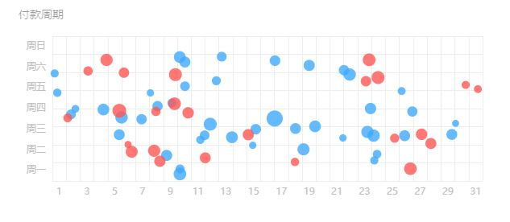
</pre>
### 5.1.6 查询 

- 可通过编辑日期，分类，金额范围等特征查询特定的流水条目，切换“全部”，“收入”，“支出”三种模式可以给给查询的流水定一个范围。

  

#### <a href="#0">back</a>

## 5.2 其他信息：补上传数据，各种上传状态的说明等 

### 5.2.1 补传数据 

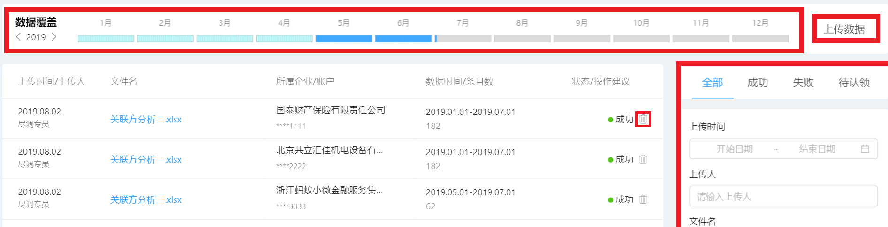

- 数据覆盖：显示当前项目下上传的流水在时间线上的覆盖度，蓝色表示覆盖，红色表示为覆盖
- 上传数据：点击数据覆盖横柱右侧的“上传数据”可以补传数据
- 删除上传的对账单：点击文件条目最右侧的“删除”标识进行删除，注意**删除对账单文件后，系统内根据该文件生成的相关数据会被清除。该操作无法撤销。 **
- 查询上传的对账单：左侧将显示对账单文件的上传历史。在右侧可以切换“全部”，“成功”，“失败”（无法识别文件模板），和“待认领”（无法识别企业/账户）来查看对应的上传文件，也可以通过上传时间，上传人等信息查询相应的上传文件。

### 5.2.2 修改项目名称 

您可以修改”进行中“的项目名称及项目简介，您也可以删除“进行中”的项目。如有需要，请点击项目卡片右上角的”设置“标识进行操作。

### 5.2.3 添加尽调人员 

如果您和其他尽调人员共享项目，请点击项目卡片右上角的”人员添加“标识并输入该尽调人员的手机或邮箱，注意**该尽调人员也必须在系统内**。

#### <a href="#0">back</a>
