**QA使用手册**

# 目录 

- <a href="#1">登陆与账号</a>
  - <a href="#1.1">注册</a>
  - <a href="#1.2">登录</a>
  - <a href="#1.3">账号与管理</a>
- <a href="#2">上传对账单</a>
  - <a href="#2.1">创建项目</a>
- <a href="#3">查看流水分析报告</a>
  - <a href="#3.1">尽调报告</a>
    - <a href="#3.1.1">流水真伪</a>
    - <a href="#3.1.2">关联方检查</a>
    - <a href="#3.1.3">个人挪用</a>
    - <a href="#3.1.4">还款能力</a>
  - <a href="#3.2">流水查询</a>
  - <a href="#3.3">数据上传</a>
  - <a href="#3.4">完成尽调</a>
    - <a href="#3.4.1">其它</a>

# 一 登录与账号 

## 1.1 注册 

可使用手机号或者邮箱进行注册，然后使用六个字符以上的字符串作为密码，如果有邀请码，请在注册的时候填上邀请码。

## 1.2 登录 

登陆方式可以手机号配合验证码登录或者邮箱（手机号）配合密码登录。如果您注册的时候使用的是邮箱，可以在密码登陆后在个人设置下的“账号密码”里绑定手机号，然后就可以使用手机号登录了。

## 1.3 账号管理 

<pre>
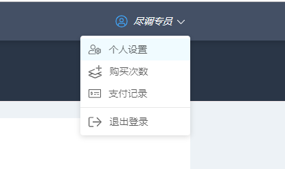   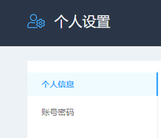
</pre>

- 可以在个人设置下的“个人信息”里完善姓名，联系电话，所在企业，职位等信息。
- 修改登陆密码可以在“账号密码”下操作。
- 在账号下还可以查看您的购买次数与支付记录。

### <a href="#0">back</a>

# 二 上传对账单 

登录账号后，如果您是新用户，页面将是空白的，请点击屏幕右上角的新建认证开始使用。如果您曾经成功上传过对账单，页面将显示您曾经创建过的项目。

## 2.1 创建项目 

1. 点击屏幕右上方的“创建项目”后，请依照窗口提示输入项目名称（必填）和项目简介（选填）。

   

2. 导入对账单数据，如果您的数据不是从网银下载的官方流水，请点击屏幕中央的“下载标准模板”，然后把数据填入标准模板后再上传。支持成批导入或手动拖拽上传银行对账单。

   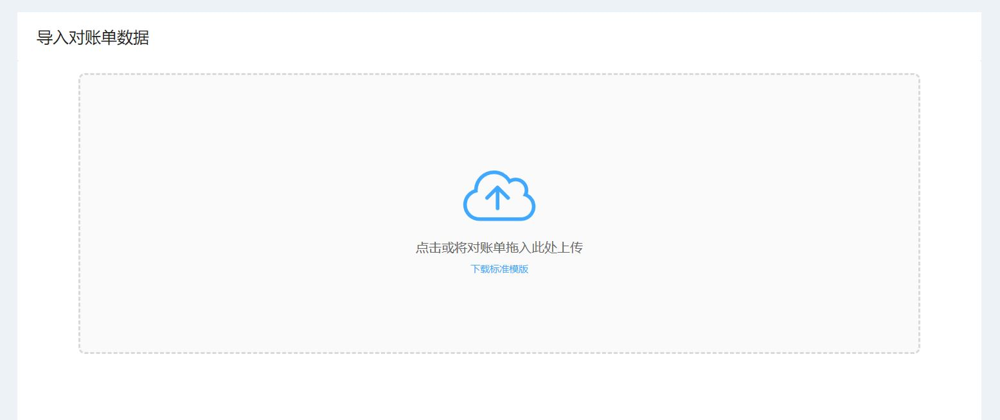

3. 如果您有多个数据文档，可以在文档解析成功后继续上传。数据上传完成后，请点击屏幕下方的“完善对账单信息”。如果您上传的数据里的公司名称、银行账户或币种没有填写或者需要修改，可以点击公司名称处进行修改。

   <pre>
   
</pre>

4. 如果您发现您重复上传或者上传了不需要的文档，也可以点击文档右边的标识进行删除。如果文档上传正确，信息识别无误，请点击完成。

   

### <a href="#0">back</a>

# 三 查看流水分析报告 

项目创建完毕后，您将会得到您所上传的对账单数据的尽调报告。尽调报告将会从数据真伪，关联方检查，个人挪用，还款能力这四个方面分析多账单数据。除此之外，您还可以进行流水查询和数据上传，持续追踪资金状况。

## 3.1 尽调报告 

左边显示尽调报告，右边显示报告目录，项目内数据文档的概况，以及尽调企业的公开工商信息。所有报告项目下方都可以点击添加尽调备注。

### 3.1.1 数据真伪 

- **对账单完整性**：系统根据导入对账单数据和资金实际进出情况做校验。如有数据缺失的话， 系统会以红色高亮提示数据缺失时间段。

  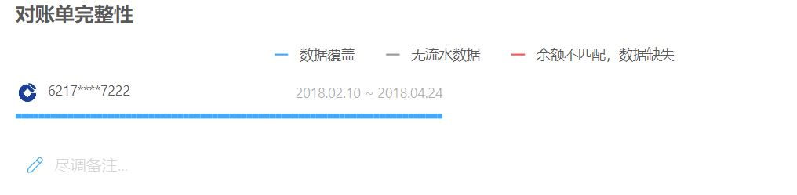

- **缺失同名账户**：

### 3.1.2 关联方检查 

- 检查流水中交易频繁，交易额较大的交易对象并显示尽调对象和它的交易流水。可以通过点击“关联方检查”右边的设置改变交易频率上限，交易额上限等捕获逻辑调整关联方检查方案。

  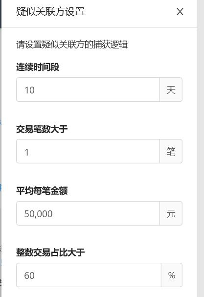

### 3.1.3个人挪用 

- 系统可捕捉到疑似挪用公款行为并列出交易详细信息

### 3.1.4 还款能力 

- **期间余额**：根据导入的对账单数据生成账户流水覆盖期间的期间余额信息，虚线标出余额平均值，并标出余额的最大值，最小值，和最新余额的数值。鼠标滑过折线图可以显示该日的资金总额。

  

- **收支盈亏**：用柱状图显示对账单流水，红色代表支出，蓝色代表收入，并显示月均收入，月均支出等基本数据，鼠标滑过柱状图可以显示该日的收入支出金额，点击柱状图内立柱即可查看当日流水明细。

  

- **收支构成**：根据对账单里的流水类别区别分析尽调对象的收入构成与支出构成。由高到低列出该收入或支出类别在整体收入或支出总额的占比。每个类别在右侧分别用柱状图列出该类别的金额状况，鼠标滑过柱状图可以显示该日的资金总额，点击柱状图内立柱即可查看当日流水明细，点击左侧横柱即可查看全部流水明细。

  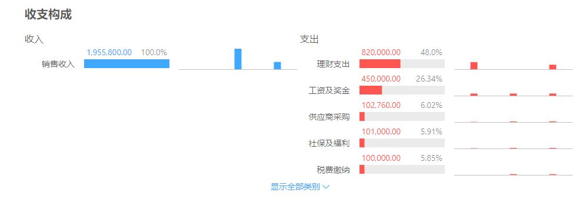

- **指标性支出**：单独合并整理出重要的支出类型--水电能源及租金、实际纳税、人力成本，计算出月均值和占总比并用柱状图展示流水。

  

- **贷款检查**：列出被尽调方的贷款以及还款情况，细化分类为银行贷款，非银机构借款，和企业拆借。点击条目可以显示对账单详情。

  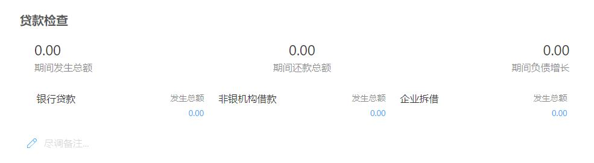

- **核心客户**：展示出主要的收款对象，计算出占总比，并用柱状图展示收款时间与金额。鼠标滑过柱状图可以显示该日的金额，点击柱状图内立柱即可查看流水明细。可以点击“核心客户”右侧的设置根据需求改变客户类型的标签调整核心客户的显示。

  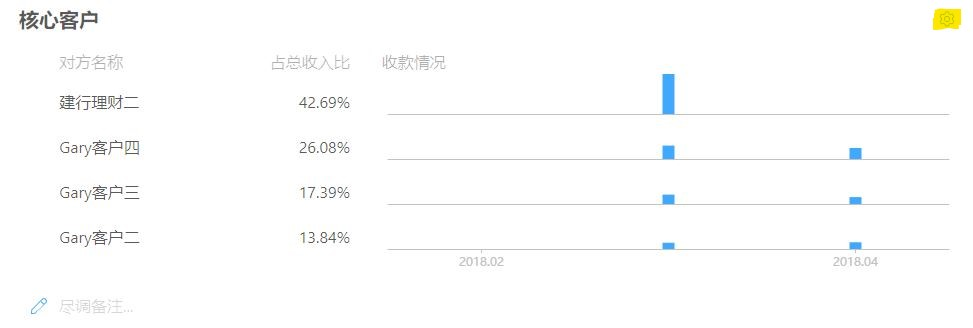

- **核心供应商**：展示出主要的付款对象，计算出占总比，并用柱状图展示收款时间与金额。鼠标滑过柱状图可以显示该日的金额，点击柱状图内立柱即可查看当日流水明细。可以点击“核心供应商”右侧的设置根据需求改变供应商类型的标签调整核心供应商的显示。

  

  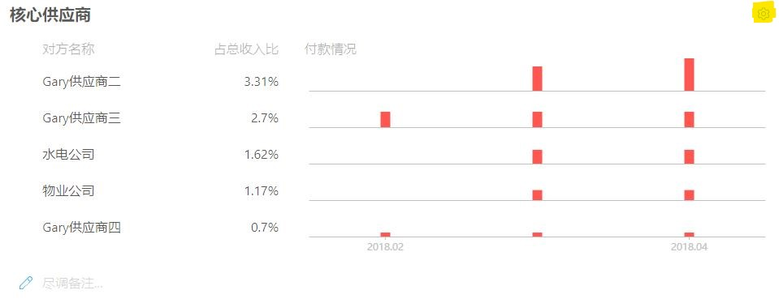

### <a href="#0">back</a>

## 3.2 流水查询 

- 排序：流水条目可以根据交易时间或条目金额进行升序或降序的排序

  <pre>
        
<pre>

- 显示总额：请点击表格上部的“统计金额”查看统计的收入总额和支出总额

  

- 对账单详情：点击流水条目即可在屏幕右侧显示该条流水的对账单详情

  

- 修改：在对账单详情内可以对该条流水的备注，分类，和标签进行修改

  - 修改流水条目摘要：左侧方框选中需要修改的条目，然后在左上“批量操作”下选择“修改摘要”，然后编辑摘要即可。如果点击表头“交易时间”左侧的方框将会选中当前页面加载了的所有条目。

    

  - 修改流水条目分类：可以通过条目左侧的方框选中一条流水然后在左上“批量操作”下选择“修改分类”来进行修改，但不支持选中多条流水使用“批量操作”。如果想要同时修改多条流水的分类，请点击条目分类栏右侧的标识，选择“新建规则批量修改”来批量修改流水分类。

    

- 对手方详情：点击对方名称即可查看对手方详情，包括标签（可修改），收支趋势，和付款周期的信息。

  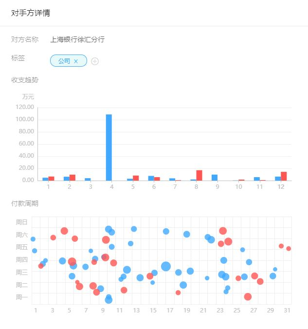

- 查询：可通过编辑日期，分类，金额范围等特征查询特定的流水条目，切换“全部”，“收入”，“支出”三种模式可以给给查询的流水定一个范围。

  

### <a href="#0">back</a>

## 3.3 数据上传 

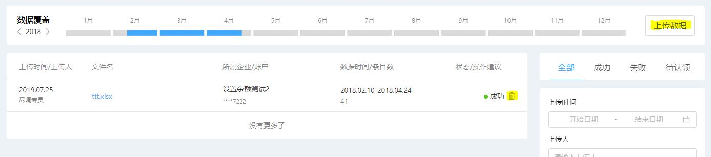

- 数据覆盖：显示当前项目下上传的流水在时间线上的覆盖度，蓝色表示覆盖，红色表示为覆盖
- 上传数据：点击数据覆盖横柱右侧的“上传数据”可以补传数据
- 删除上传的对账单：点击文件条目最右侧的“删除”标识进行删除，注意**删除对账单文件后，系统内根据该文件生成的相关数据会被清除。该操作无法撤销。 **

- 查询：左侧将显示对账单文件的上传历史。在右侧侧可以切换“全部”，“成功”，“失败”（无法识别文件模板），和“待认领”（无法识别企业/账户）来查看对应的上传文件，也可以通过上传时间，上传人等信息查询相应的上传文件。

## 3.4 完成尽调 

阅览完流水分析报告后，可以在尽调报告下，点击屏幕右上方的“完成尽调”，对被尽调方进行一个项目风险评价（“低”，“中”，或“高”）并保存。然后您就可以在首页”我的项目“下的”已完成“中找到您刚刚完成的尽调项目。如果没有对项目风险进行评价就返回首页，那么该项目将会被归到”进行中“。如果您需要修改”进行中“或”已完成“的项目，您可以点进条目再次进行操作。

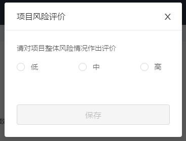

### 3.4.1 其它 

- 修改项目名称：您可以修改”进行中“的项目名称及项目简介。如有需要，请点击项目卡片右上角的”设置“标识进行操作

  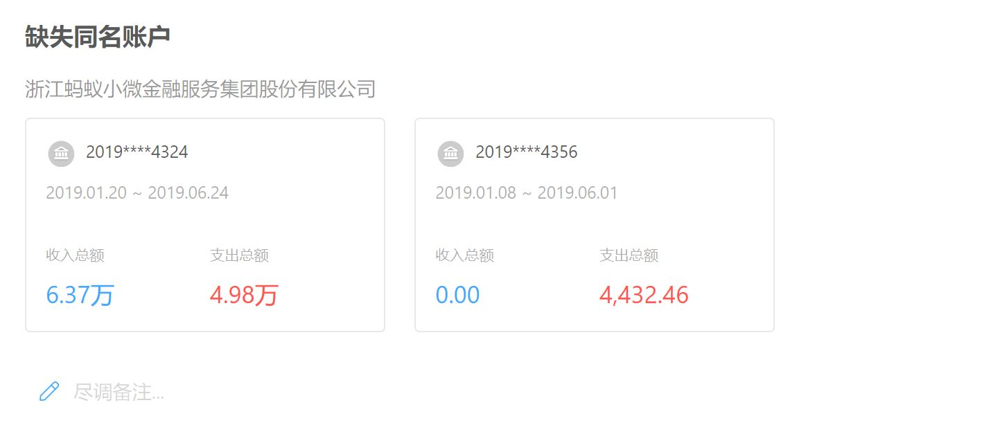

- 添加尽调人员：如果您和其他尽调人员共享项目，请点击项目卡片右上角的”人员添加“标识并输入该尽调人员的手机或邮箱，注意**该尽调人员也必须在系统内**。

  

### <a href="#0">back</a>