**见知现金流分析系统**

**4.0 版用户使用手册**

**摘要**

本手册为用户提供使用系统的方法和步骤

如有其他非标配功能使用需求请联系您的业务代表

见知数据科技（上海）有限公司

service@xencio.com

# 目录 

- <a href="#一资金看板">一 资金看板</a>
  - <a href="#1.1对账单上传历史覆盖图（数据缺失提示图）">1.1 对账单上传历史覆盖图（数据缺失提示图）</a>
  - <a href="#1.2自选价值看板">1.2  自选价值看板</a>
  - <a href="#1.3滚动预测（当前月）">1.3  滚动预测（当前月）</a>
  - <a href="#1.4理财贷款变动看板">1.4理财贷款变动看板</a>
- <a href="#二经营分析">二 经营分析</a>
  - <a href="#2.1核心指标">2.1 核心指标</a>
  - <a href="#2.2余额管理">2.2 余额管理</a>
    - <a href="#2.2.1历史资金构成">2.2.1 历史资金构成</a>
    - <a href="#2.2.2期间明细">2.2.2 期间明细</a>
  - <a href="#2.3收支结构">2.3 收支结构</a>
    - <a href="#2.3.1收支分类呈现">2.3.1 收支分类呈现</a>
    - <a href="#2.3.2类别组的设置">2.3.2 类别组的设置</a>
    - <a href="#2.3.3收支分类趋势与交易明细">2.3.3收支分类趋势与交易明细</a>
      - <a href="#2.3.3.1.分类趋势整体显示">2.3.3.1. 分类趋势整体显示</a>
      - <a href="#2.3.3.2.收支分类修改及批量规则设置">2.3.3.2. 收支分类修改及批量规则设置</a>
- <a href="#三资金台账">三 资金台账</a>
  - <a href="#3.1对账单查询">3.1 对账单查询</a>
  - <a href="#3.2投资理财台账">3.2 投资理财台账</a>
  - <a href="#3.3融资贷款台账">3.3 融资贷款台账</a>
  - <a href="#3.4银行保函">3.4 银行保函</a>
  - <a href="#3.5承兑汇票">3.5 承兑汇票</a>
- <a href="#四资金预测">四 资金预测</a>
  - <a href="#4.1滚动预测">4.1 滚动预测</a>
    - <a href="#4.1.1滚动预测看板">4.1.1 滚动预测看板</a>
    - <a href="#4.1.2滚动预测设置">4.1.2 滚动预测设置</a>
    - <a href="#4.1.3滚动预测日历">4.1.3 滚动预测日历</a>
    - <a href="#4.1.4滚动预测方式选择">4.1.4 滚动预测方式选择</a>
  - <a href="#4.2趋势预测">4.2 趋势预测</a>
    - <a href="#4.2.1余额预测折线图">4.2.1余额预测折线图</a>
    - <a href="#4.2.2资金安全线设置">4.2.2 资金安全线设置</a>
- <a href="#五风险控制">五 风险控制</a>
  - <a href="#5.1.1疑似拆分付款">5.1.1 疑似拆分付款</a>
  - <a href="#5.1.2疑似挪用公款">5.1.2 疑似挪用公款</a>
  - <a href="#5.1.3疑似重复扣款">5.1.3 疑似重复扣款</a>
  - <a href="#5.1.4大额收支预警">5.1.4 大额收支预警</a>
  - <a href="#5.1.5疑似虚假对账单">5.1.5 疑似虚假对账单</a>
- <a href="#六对手方分析">六 对手方分析</a>
  - <a href="#6.1对手方分析">6.1 对手方分析</a>
  - <a href="#6.2收付方重合">6.2 收付方重合</a>
- <a href="#七报表中心">七 报表中心</a>
- <a href="#八设置">八 设置</a>
  - <a href="#8.1规则设置">8.1规则设置</a>
  - <a href="#8.2数据上传">8.2 数据上传</a>
  - <a href="#8.3银行账户">8.3 银行账户</a>
  - <a href="#8.4企业维护">8.4企业维护</a>
  - <a href="#8.5授权管理">8.5授权管理</a>
  - <a href="#8.6利率设置">8.6 利率设置</a>
  - <a href="#8.7汇率设置">8.7汇率设置</a>
  - <a href="#8.8账户设置">8.8账户设置</a>
    - <a href="#8.8.1账号更新">8.8.1 账号更新</a>
    - <a href="#8.8.2个人信息安全">8.8.2 个人信息安全</a>
- <a href="#FAQ">FAQ</a>

# 一 资金看板 

功能概述：资金看板中集中展示现金流分析模块中各个功能的核心高质量数据汇总，从对账单历史，收支分类等微观层面的数据分析和汇总展示到资金结构，余额管理，滚动预测和理财变动情况等宏观层面企业财务数据可视化呈现，从财务管理角度对企业经营状况进行全方位的数据透视。

资金看板页面显示的是当前页面单币种向下的资金汇总。资金总额涵盖了当前活期、理财和承兑汇票的金额汇总。

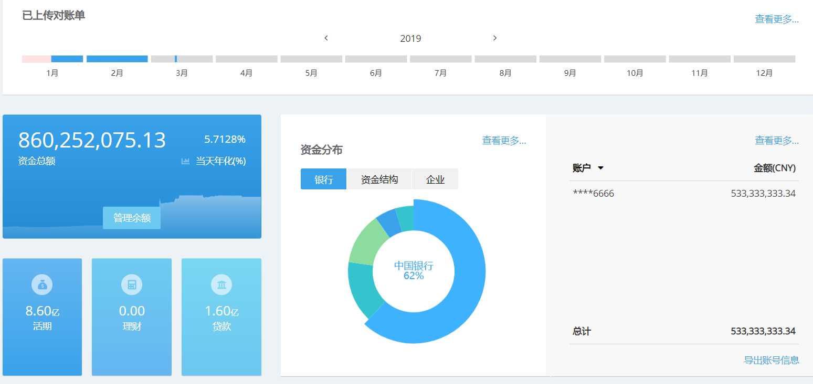

## 1.1 对账单上传历史覆盖图（数据缺失提示图） 

- 系统根据导入对账单数据和资金实际进出情况做校验。如有数据缺失的话， 系统会以粉色高亮提示数据缺失时间段。

- 点击数据条状图可以查看具体银行账号流水的情况。若缺失， 银行账号卡片会有提示。可根据提示补传流水。

## 1.2  自选价值看板 

首页提供快捷的当期收支总览，可快速查看企业收支及现金流层面的盈利情况。

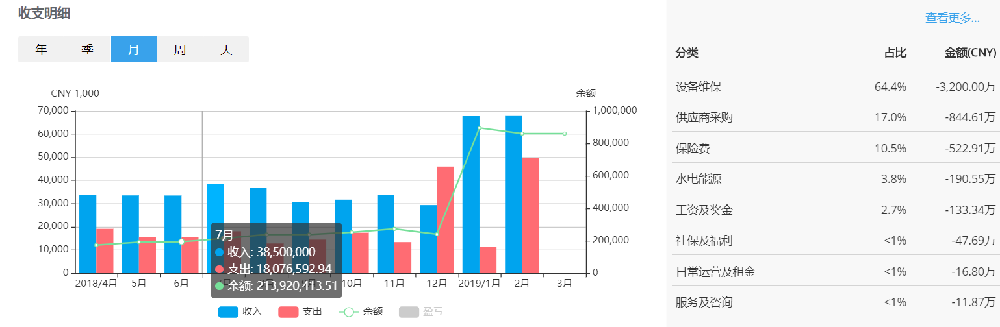

此处跟“收支结构”相关联，隐藏的交易类别的金额不会显示。

## 1.3  滚动预测（当前月） 

如企业配置了预测模块，首页会提示当前月份滚动预测的进度。

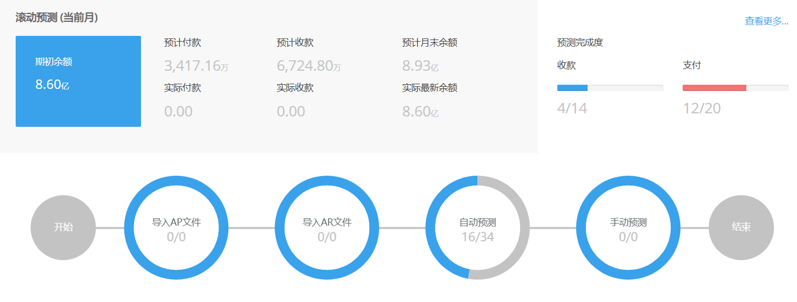

## 1.4理财贷款变动看板 

整合展示投融资管理模块中的数据信息，如企业开通承兑汇票， 也会统一在这里显示。

对于即将到期的理财或贷款计划进行展示30天内的提醒，以便企业提前进行资金规划。

<a href="#目录">back</a>

# 二 经营分析 

## 2.1 核心指标 

CFA4.0内嵌一系列的评估逻辑，分析在当前币种下的企业业务经营情况。用户可以根据企业的需求情况选择需要的指标来看，也可以将指标下载成PDF发送。

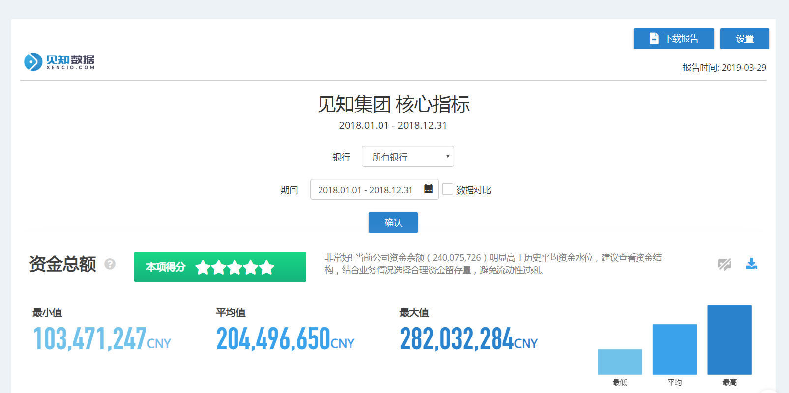

- 设置：可以隐藏指标，不需要的指标在当前页不显示
- 每个指标下面都有备注选项框， 支持用户在线做信息交互，且可以随报告一起下载
- 数据分析根据当前所选的银行、时间段来进行关联

 

## 2.2 余额管理 

本页面是对集团公司的所有资金进行汇总的显示，并可以切换不同的维度进行数据查看：可按照金融机构，资产结构，和账号类别三种分类方式查看。并可以根据日期的期间段来进行数据的展示。

这里系统提供全货币功能， 可将不同货币按照汇率折换成人民币或其他目标货币来计算集团或公司的资金总额。可以在右上角的货币处， 选择“全货币”，在页面下方查看集团（或公司）的所有币种资金汇总情况。

### 2.2.1 历史资金构成  

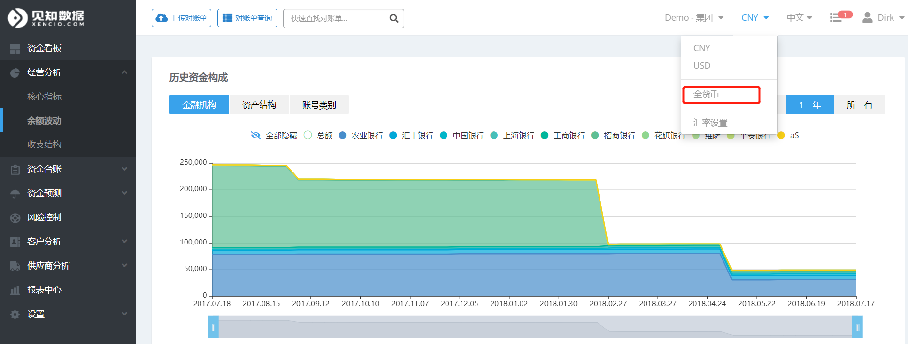

- 按照不同分类方式展示企业资金整体变动
- 可拖拽下方滚动条选定查看任意时间段的趋势
- 鼠标悬浮状态时会显示具体每个账户金额信息

 

### 2.2.2 期间明细 

- 可根据起始时间周期来查看特定时间段内的资金期初、期末和期间的收入和支出情况。期初余额为所选起始日期的当日日初余额，期末余额为所选终止日期的当日日末余额。
- 可按照金融机构、资产结构和账号类别来显示期间的资金变化
- 这里的资金包含了所有的活期、银行理财模块（理财模块中所有的理财类型）和承兑汇票模块（应收汇票部分）的资金汇总。承兑汇票的计算中，如下状态不计入“承兑汇票”的余额（余额波动）加总：已收款，已背书，退回客户，已贴现，质押给银行。其中，“质押”和“退还客户”是直接不计入的。其他状态（已收款、已背书、已贴现）根据到期时间从汇票的资金总额中扣除，扣除掉的资金会显示在期间支出当中。“保险箱”状态下的汇票金额会一直计入汇票的资金总额，“其他”状态在没有完成日期之前， 也一直计入到汇票的资金总额。
- 右上方有导出按钮，可导出任意所选日期期间的资金构成明细。

## 2.3 收支结构 

CFA4.0根据流水中的交易金额， 自动绘制出收支趋势图，可按年、季、月、周或天的维度显示。

### 2.3.1 收支分类呈现 

- 可按自定义时间段呈现收入与支出交易占比分类
- 展示收入分类和支出分类的项目类别，并显示其占比，金额与交易笔数
- 可对于非经营性的收入/支出类别进行隐藏，防止造成收入/支出的虚高。如需参与计算，隐藏过的类别也可以再次取消隐藏。系统内默认隐藏同名户转账（同一个公司内部的不同账号间的交易往来）和往来拆借（同一集团家不同分子公司见的交易往来）。如果“往来拆借”中有内部公司间的采购行为，则可针对此类交易单独设置规则进行类别的区分（例如按照对方名称或者账号或备注等）
- 右上方的“导出”按钮可以将期间内的收支交易导出excel表格

### 2.3.2 类别组的设置 

系统默认将企业的收入和支出类别分为3个大组：经营性、投资性和筹资性。如企业用户有自身需求需重新分组，可在左上方“分组方式中”重新编辑分组。

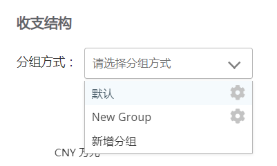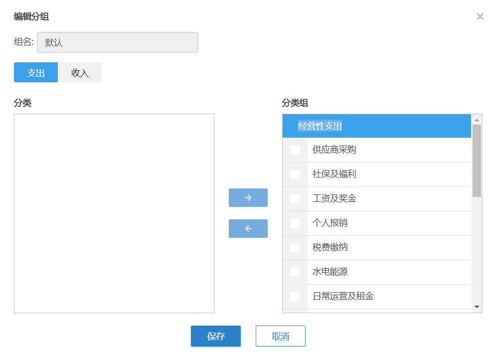

### 2.3.3收支分类趋势与交易明细 

#### 2.3.3.1. 分类趋势整体显示 

- 各个项目类别均按月分类显示近三年内同项目资金投入或支出的柱状对比图（可收缩隐藏）

- 支持各个项目类别的交易明细查询与报表导出

- 点击到某个交易类别， 可进入当前类别对交易进行查找或修改分类。详见下图说明：

  

- 按交易期间查询某类别交易明细，可批量处理当前类别下所有交易，进行批量类别修改或批量摘要修改（见上图）。

  

- 按交易期间查询某类别交易明细，可批量处理当前类别下所有交易，进行批量类别修改或批量摘要修改。修改备注时，新备注会覆盖掉原备注（见上图）。

#### 2.3.3.2. 收支分类修改及批量规则设置 

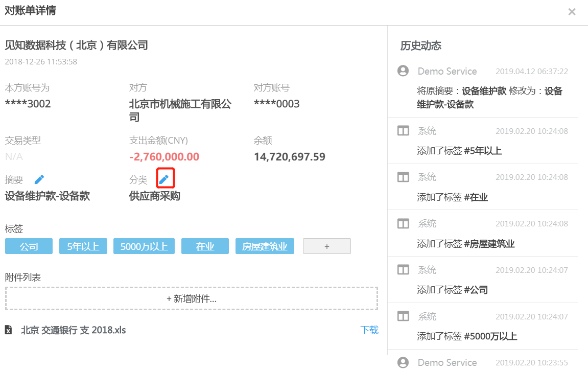

- 点击某条分类有误或者需要调整分类的流水，可查看到所有当前流水相关的历史动态，可添加标签，或增加说明性/支持性附件。

- 点击“分类”旁边的编辑按钮，可以如下图所示修改分类或设置自动分类规则：

  

- 选中正确分类，点击“批量修改”旁边的编辑按钮，进入到下一步进行规则设置：

  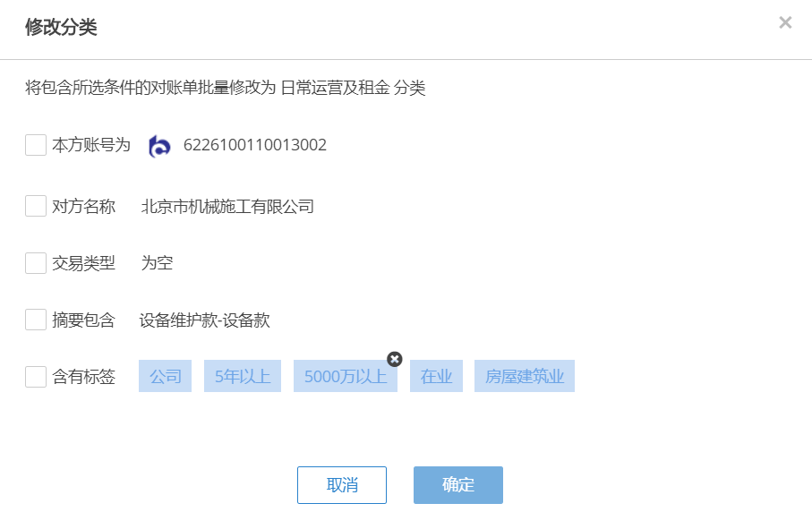

- 在上述当前页面中可以根据页面上显示的5个条件分别或合并条件设置自动分类规则，修改后点击“确定”。以后导入的流水会按照当前设定的规则进行自动分类。所有当前符合规则的系统中现存流水也会根据规则自动运行调整。

<a href="#目录">back</a>

# 三 资金台账 

CFA4.0提供多种方式的资金台账查询及录入，企业用户可快速跨银行多账户同时进行查询。

## 3.1 对账单查询 

对账单查询界面可按多种条件-如时间段、类别（支持复选类别）、账号、交易类型、精准金额/模糊金额匹配等方式提供交易流水的查询。查询出的流水可进行点击查看详情或修改分类的操作。

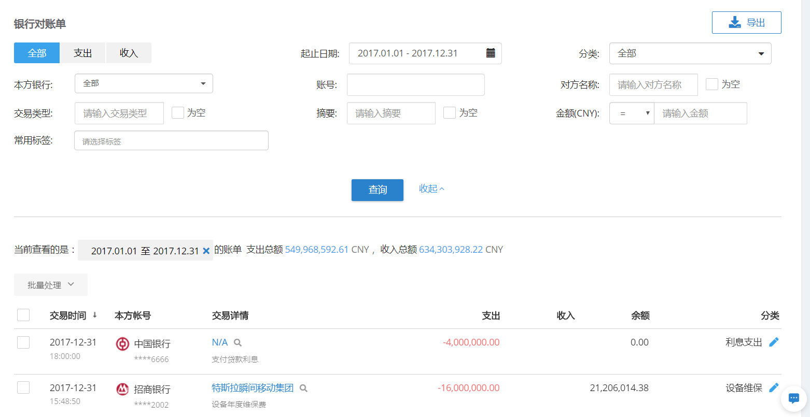

## 3.2 投资理财台账 

轻松对投资不同时段不同类型的多个项目进行项目管理

避免因为投资项目过多，管理不及时造成不必要的资金闲置

- 用户可自行手工登记当前企业所进行的投资理财项目，填写相应的利率和时间段信息。系统会自动计算预计的项目收益。
- 系统会将银行流水中自动捕获到的理财扣款类的流水进行提示，在“待办事项”显示卡片中自动提示用户认领理财项目。减少手工录入工作。（此处仅限分类为“理财支出”类别的流水会被自动提示。举例：投资理财中有100条流水，且有10条已经进行了理财关联，则会在待办事项中提示待认领理财为97条）
- 项目即将到期时通过首页通知栏进行提前30天到期提示。用户可将银行回款流水（本金及利息）与本条理财项目进行关联

 

## 3.3 融资贷款台账 

  系统支持对融资贷款进行全盘管理， 贷款资金根据不同的状态与企业资金总额发生联动。

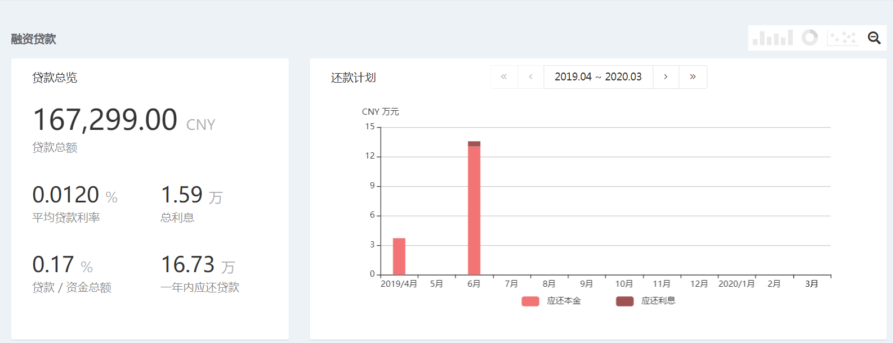

- 系统显示当前进行中贷款总额，并根据贷款期限提示后续的还款计划（见上图）

  

- 每条贷款明细可以关联银行放款流水记录， 作为入账记录关联。也可以在还款时将还款流水进行关联（见上图）

  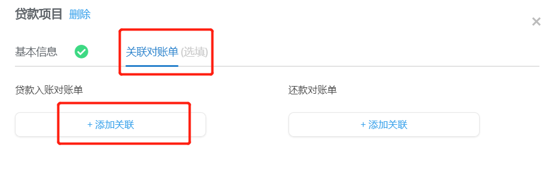

- 关于当前流水进行关联对账单的操作（见上图）

## 3.4 银行保函 

系统可将企业的保函进行登记， 进行增删改查的操作，统一管理。

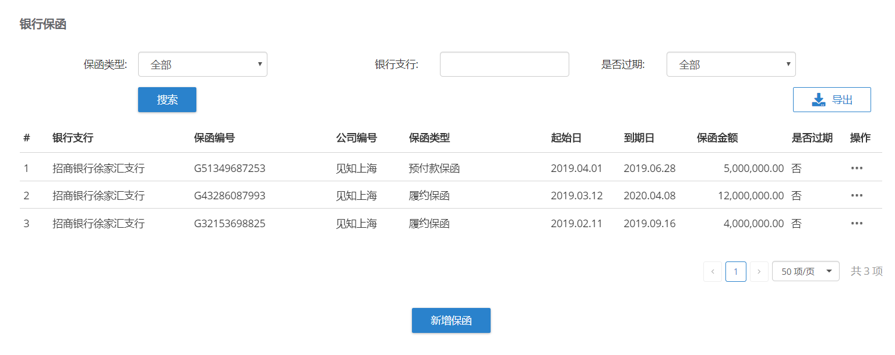

新增保函

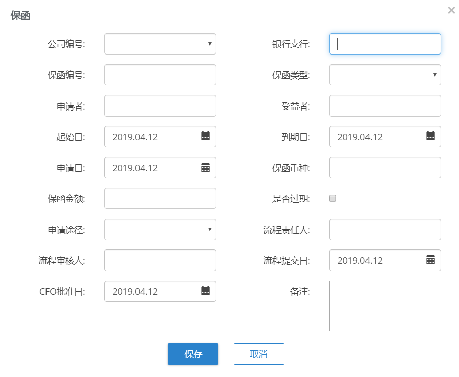

## 3.5 承兑汇票 

系统可将承兑汇票做统一管理，并将不同状态的汇票的金额进行资金加总。共分为应付汇票和应收汇票两种类型。

其中， 应收承兑汇票的金额会参与到企业的资金余额中， 根据不同的汇票状态来进行汇总。详情见下图讲解。

- 表格中的字段含义：

  客户号：企业给客户标志的客户编号

  客户名称：指的是当前汇票是哪家客户给到企业的

  接受银行：指企业的这张汇票放在哪家银行，或者去哪家银行贴现

  移交银行日子：指企业哪天给银行的（如委托银行托收， 或给银行贴现的日期）。该日期不参余额的计算规则。

- 票据状态与余额加总的规则：

  如下状态不计入“承兑汇票”的余额（余额波动）加总：已收款，已背书，退回客户，已贴现，质押给银行。其中，“质押”和“退还客户”是直接不计入的。其他状态（已收款、已背书、已贴现）根据到期时间从汇票的资金总额中扣除，扣除掉的资金会显示在期间支出当中。“保险箱”状态下的汇票金额会一直计入汇票的资金总额，“其他”状态在没有完成日期之前， 也一直计入到汇票的资金总额。

<a href="#目录">back</a>

# 四 资金预测 

CFA4.0提供短期滚动预测和长期趋势预测两种预测方式来对企业资金进行预测。短期滚动预测可根据历史企业的流水数据（至少13个月以上数据）来预测未来每个月的细分类别的资金进出金额。长期趋势预测则需要根据历史24个月以上数据， 通过后台调用相应的数学模型来预测未来的单月期末余额， 用以预测企业资金水位，防止资金短缺或断裂的风险，提高资金使用效率。

我们建议企业的资金部同事企业的实际情况，较为频繁的使用滚动预测，以系统计算为主，辅以业务实际的因素调整， 可以得到非常准确的短期滚动预测。

## 4.1 滚动预测 

按照期初余额，现金支出，现金收入，现金流动和期末余额为类别，基于对收入支出的详细类别细分交易的历史沉淀数据分析和投融资的联动，利用不同数学模型对各个细分类别进行智能滚动预测

可按公司业务类型和实际情况自选自动预测方式也可通过手工输入和导入文件进行预测方式选择

人性化的开锁解锁功能可保存任意历史预测或不愿改动的类别预测值

通过付款日历 对因周末或假日的付款日期及时调整 让付款信息清晰可查

### 4.1.1 滚动预测看板 

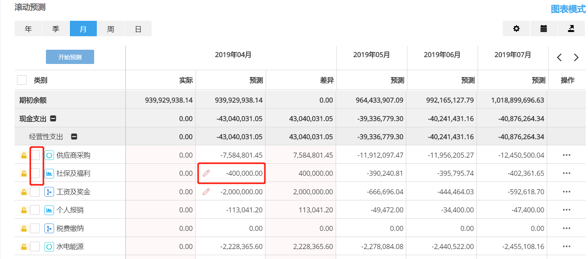

- 右上方分别是 滚动预测设置；付款日历；和预测报表导出功能按钮
- 可针对不同的类别打钩， 单独对某类别进行预测。也可以全选， 对所有类别进行预测
- 可以在某些类别，根据业务实际情况进行手工调整，以获得更准确的预测值

### 4.1.2 滚动预测设置 

可以根据企业需要对滚动预测的方式和历史数据呈现做设置。历史数据默认只显示实际值， 可调整为“显示实际值、预测值和差异”，则可以回看到历史月份的预测值、实际值及两者的差异。

### 4.1.3 滚动预测日历 

滚动预测提供预测日历，可将企业特定的某些类别的收付款设置到指定的日期来进行预测。

滚动预测的基本默认是按月预测， 预测值会落在每个月的1日。可切换至周和日的视角去看预测值。如付款日历中没有设置， 则切换至周或日的视角时， 会看不到数据（因为预测数值都在1日那天）。下方的付款日历则是针对这一情况，可以针对企业需要， 将实际的付款或者收款的某些类别的日期设置到某些特定的日期。比如公积金扣款， 如果设在20日， 则每个月的公积金预测值就会落在20日这天。 如设置在每周四，则公积金付款的预测值会被平均拆分成4等分， 分别落在每周四。这样则在周视角或日视角的时候， 可以看到预测值。

### 4.1.4 滚动预测方式选择 

  系统提供多种方式进行滚动预测

<pre>
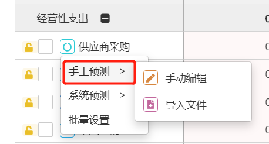   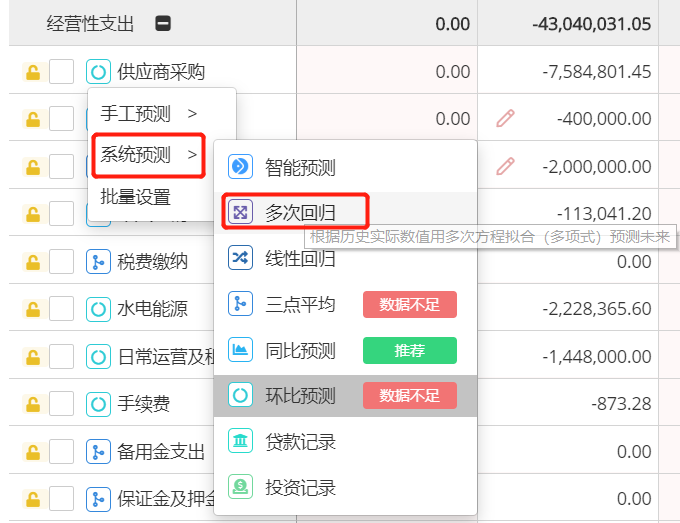
</pre>
- 每个类别支持3种大方式的预测：手工， 系统或批量设置。

  - 手工预测：某些类别，根据业务实际情况可进行手工编辑，以获得更准确的预测值。也可以导入类似应收/应付等有明确账期和到期日的数据（例如ERP中的数据），系统会自动根据付款日历汇总预测数值。其中， 导入文件（AR、AP）这种方式会结合自身的due date和日历中的设置日期同时来计算预测值的具体日期。如：公积金付款， 如果AP的due date为4月20日， 而系统付款日历中的的公积金付款日为4月18日， 则系统会去核对“滚动预测设置”中的“拆分防范”设置为*日历向前靠近*还是*日历向后靠近*。如日历向前靠近， 则预测值会落到4月18日。如日历向后靠近， 则预测值会落到下一个付款日历日， 即5月18日。
  - 系统预测：系统提供多种预测方式，鼠标落到每个方式的时候， 会悬浮出预测的计算逻辑。
  - 批量设置：可根据企业自身需求， 按照期间段和批量方式来设置规则逻辑。

  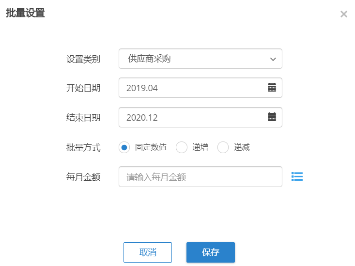

## 4.2 趋势预测 

### 4.2.1余额预测折线图 

- 系统根据历史数据可对所选定的结束日期进行余额的趋势预测，预测结果可以保存，在右上方“查看过往预测”处可以按保存日期查看
- 预测值与实际值可进行对比

### 4.2.2 资金安全线设置 

- 系统根据数据计算推荐给企业资金安全线（计算逻辑：六个月的总支出和历史余额的P75里取小的那个）
- 可根据企业实际情况对资金安全线进行动态调整
- 通过数据分析， 对企业的安全资金和安全周期推荐可进行投资理财的资金金额和天数（天数以月为周期）

<a href="#目录">back</a>

# 五 风险控制 

通过对银行对账单的系统性分析与对历史数据的规则沉淀，并使用算法计算 多角度感应现金流风险

### 5.1.1 疑似拆分付款 

系统可捕捉到疑似分拆付款行为并列出交易详细信息：

### 5.1.2 疑似挪用公款 

系统可捕捉到疑似挪用公款行为并列出交易详细信息

### 5.1.3 疑似重复扣款 

轻松捕获一般人工难以察觉的各类疑似重复扣款（同一供应商同一天的扣款）

### 5.1.4 大额收支预警 

按照资金总额和交易类型进行大额收支预警

### 5.1.5 疑似虚假对账单 

通过系统分析可捕获疑似虚假对账单 极大降低舞弊风险

<a href="#目录">back</a>

# 六 对手方分析 

通过系统智能分类与数据支持，以真实交易流水数据为基础，轻松管理客户和供应商，了解企业业务伙伴往来情况，简单便捷的做核心客户/供应商与本企业的交易分析。

## 6.1 对手方分析 

系统根据对方是付款给本企业的付款方， 还是从本企业收款的收款方， 亦或是有收有付的重合的情况， 来从交易金额维度，和地理位置维度来总体显示。显示维度可以选择“金额”或“笔数”。

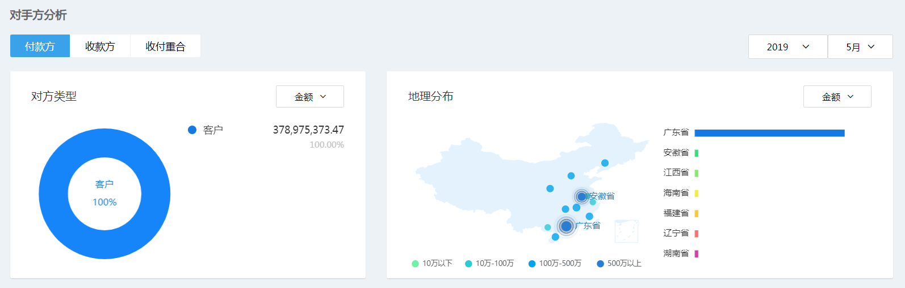

收付款方的详情会在如下页面显示。用户可以对对手方的类型和所在区域进行编辑和修改。

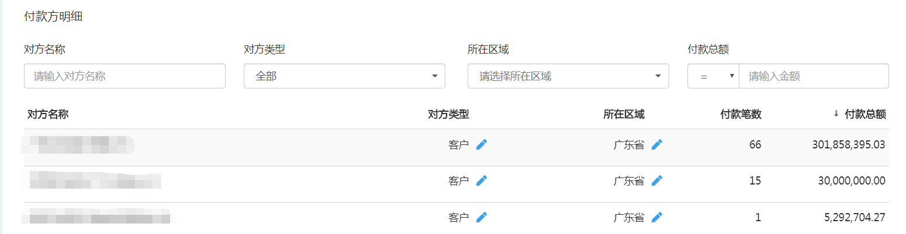

点击对手方企业名称， 可以查看到该对手方的公开工商信息，方便企业快速了解交易对方。

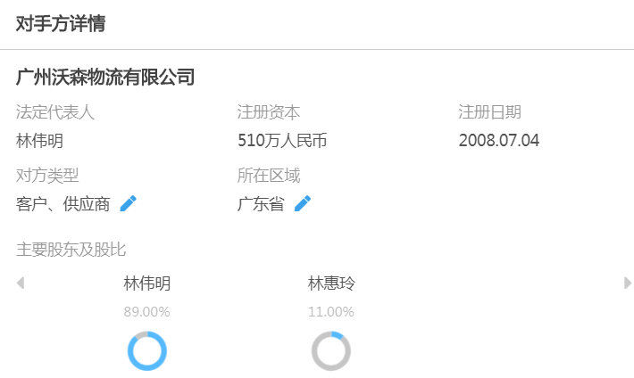

同时系统会将某一时间段的与该交易对手方的收入和支出往来情况做一个数据透视图， 绘制出交易趋势。

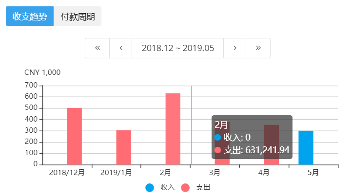

## 6.2 收付方重合 

根据流水交易情况，将同一个对手方与本企业发生的往来交易金额进行抓取，在一个月时间段内（用户可在页面配置），将企业对该对手方的收入和支出情况做汇总， 并进行比例计算。通过这种方式来促进与企业交易对手方的业务良性发展。（收支比=收入/支出）

<a href="#目录">back</a>

# 七 报表中心 

 CFA4.0 提供多种资金类相关的报表。用户可根据自己的需要进行导出。

 其中：现金流量表需要进行前期分类的一次性匹配设置。银行余额调节需要额外跟ER做一个接口。

<a href="#目录">back</a>

# 八 设置 

- 清晰的企业层级，个性化的企业分组与授权管理
- 数据上传历史及数据缺失提示
- 账号安全及多种方式登录 
- 中英文快速切换 人民币和美元等多币种账户切换 

 

## 8.1规则设置 

用户可根据需要对收支分类的类别进行规则设置，新建规则。

- 系统会自动捕获规则创建的时间和创建者
- 新建规则可根据如上图所示的点击创建

## 8.2 数据上传 

功能描述：

- 支持成批导入或手动拖拽上传银行对账单

- 已上传对账单进度条会显示当前是否有账户有对账单缺失的状况。 如有缺失， 系统会以浅红色提示。点击进入，可查看当前缺失的账户和缺失的时间日期段（如下图所示）

  

- 用户可点击缺失时间段进行流水补上传（如下图所示）

  

  已上传记录在下方列表可搜索查询。 上传记录中有状态提示。 如有新账号需认领的， 请点击下方向下箭头， 认领对账单中的账号到所属企业。

## 8.3 银行账户 

系统将统一管理银行账户，进行跨银行多账户的搜索。用户可在该功能模块下编辑账户信息。

银行账户余额可编辑（如对账单中不含有余额列的情况下）。如当前账号的企业所属关系有误， 也可以在页面上进行重新关联。如用户关闭了银行账户， 关闭账户的余额不再参与余额汇总计算（关闭账户的余额会存在资金汇总里截止上一个系统内有对账单上传数据的日期）。

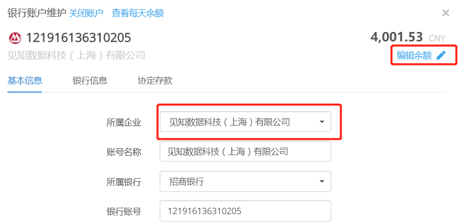

## 8.4企业维护 

用户可新增企业，组或集团，也可以对当前的企业进行修改编辑。

## 8.5授权管理 

企业管理员用户可以针对集团层面或公司层面进行授权管理。可增加授权或取消授权。

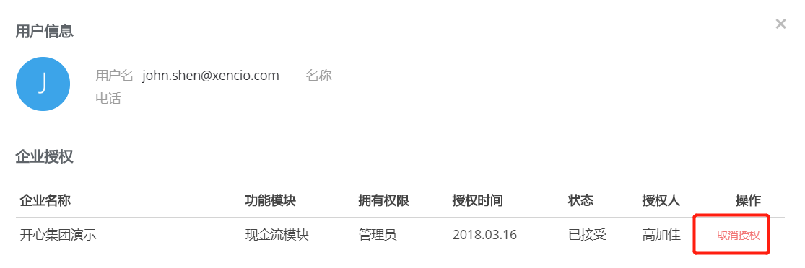

## 8.6 利率设置 

用户可以设定企业自身的活期利率，系统会自动计算年化收益率。

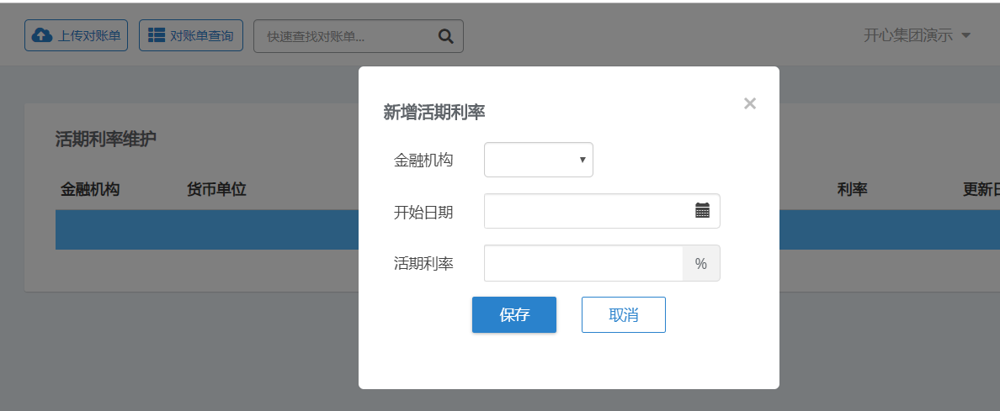

## 8.7汇率设置 

用户可以设定企业自身需要设置汇率。未设置汇率时，系统将采用中国银行当日汇率折算价进行计算

## 8.8账户设置 

### 8.8.1 账号更新 

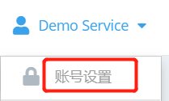

### 8.8.2 个人信息安全 

 可绑定手机号进行登录。可重置登录密码。

<pre>
   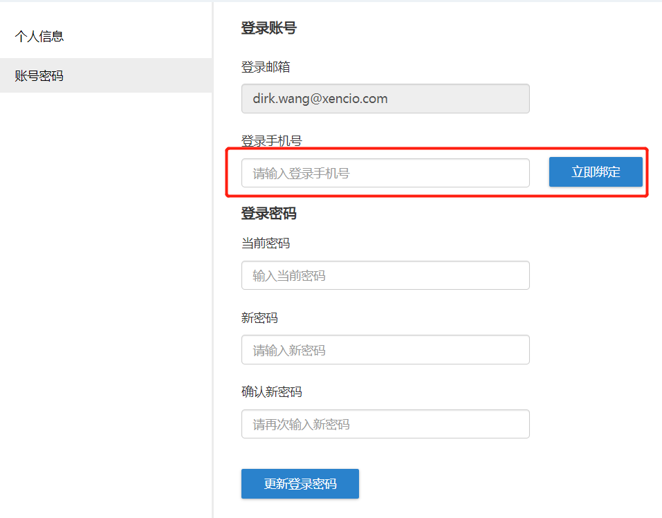
</pre>
#### <a href="#目录">back</a>

# FAQ 

### 1. 如何删除错误上传的账号、数据？

- 目前系统中用户无法自行删除已存在的账号或成功上传的对账单，请联系售后支持人员协助删除
  - 未上传成功的待认领账号的对账单，用户可在页面上“待办事项->回击“上传对账单”按钮->找到需要删除的对账单->”删除文件”

### 2.  系统的菜单栏怎么没有显示出来？

- 先检查一下您的浏览器，使用chrome浏览器打开系统菜单栏就会正常显示出来了。

### 3. 为什么上传一样的账号被“重复”识别了？

- 如果您上传的是上海银行的对账单， 请核对对账单上面的账号是否跟日常使用的账号为同一个账号。 建议以对账单上面的账号为准。
- 请检查您上传的账号是否含有含有空格，标点等垃圾字符，可能会造成看似相同的两个账号产生。 请删除特殊符号或垃圾字符后重新上传。

### 4. 为什么无法上传或无法识别对账单？

- 请检查您上传文件的失败错误信息，如提示模板未识别，请联系售后支持人员，我们将第一时间处理对账单的解析。
- 系统不支持PDF或手工修改过格式行列的其他文件。 请确认您上传的是银行的原始流水文件。
- 如有现金账或需上传手工模板， 请下载系统中的“现金账模板”，确保必填项都填好，日期、金额及借贷方向无误后上传。
- 最后请检查您上传对账单的语言版本，上传的文件最好是英文版或中文版，其他语言版本容易携带大量乱码符号

### 5. 为什么系统会提示缺失对账单交易？

- 系统会根据各账号关联的对账单交易和相对应的余额来匹配校验上传记录。当校验结果不匹配， 则提示缺失交易。请根据提示从银行重新下载缺失时间段的对账单， 上传至系统中。

### 6. 为什么系统显示的资金金额与实际情况不符？

- 请核对是否有已关闭账户。已关闭账户还有余额的， 应将余额清理至0再关闭。否则关闭账户的金额也会进行资金加总， 导致整体资金余额虚高。
- 当企业有多币种的时候，请注意选择“全币种”来保证资金总额已涵盖所有币种
- 系统中的资金总额是基于所维护的账号数量和对账单的数量的。如有对账单没有上传， 或银行账号不存在于系统中， 则会造成资金总额的偏差。
- 另外， 请关注是否维护准确了所有的理财产品，以确保资金总额的正确性。

### 7. 系统是如何处理汇率的？

- 如企业有外币交易， 系统会每日抓取中国银行的当日折算价来计算。如用户有在系统中维护本企业汇率，则系统会优先使用企业汇率计算。

### 8. 如何调整理财的期限？

- 如果要把浮动期限的理财调成固定期限，需要在固定期限下重新建立一条理财并把浮动期限下的理财删除
- 如果理财到期后没有赎回，只需要在系统中重新编辑理财的结束日期就行了

### 9. 为什么对手方分析里出现了很多“其他”的位置信息？

- 系统会根据交易对手方的工商信息中的地理位置信息来做对手方所在城市位的判断。 当一些企业没有明确的地理位置信息时， 系统会显示为“其他”。用户可在界面上自行编辑更新这个地理位置信息。

### 10. 如何处理体系外的往来拆借？

- 目前不在系统里的企业跟在系统里的企业发生往来拆借的金额无法设置成往来拆借。可将这部分交易的类别先设置成不是往来拆借， 然后等这些体系外的企业纳入进来系统以后， 再将类别改成往来拆借

### <a href="#目录">back</a>

